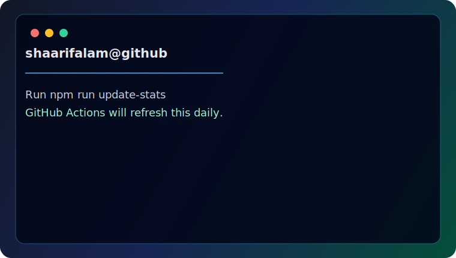

<div align="center">

# Sheikh Shaarif

### UI/UX Designer • Frontend Developer • IoT Software Designer

</div>

<table>
<tr>
<td valign="top" width="45%">

<pre>
&&&&&&&&&&&&&&&&&&&&&&&&&&&&&&&&&&&&&&&&&&&&&&&&&&&&&&&&&&&&&&&&&&&&%%
&&&&&&&&&&&&&&&&&&&&&&&&&&&&&&&&&&&&&&&&&&&&&&&&&&&&&&&&&&&&&&&&&&&&%%
&&&&&&&&&&&&&&&&&&&&&&&&&&%%&&&%&%%&%&&&&&&&&&&&&&&&&&&&&&&&&&&&&&&&%%
&&&&&&&&&&&&&&&&&&&&&&&&%%%#%##%#(#*.,*/%&&&&&&&&&&&&&&&&&&&&&&&&&&&%%
&&&&&&&&&&&&&&&&&&&&&%%%%(,,,......  ...,**%&&&&&&&&&&&&&&&&&&&&&&&&%%
&&&&&&&&&&&&&&&&&&&%%#(*,,*,  ,.    ....,/,.(%&&&&&&&&&&&&&&&&&&&&&&%%
&&&&&&&&&&&&&&&%%%%%#*,,,.... ,.   .  . .   ./%&&&&&&&&&&&&&&&&&&&&%%%
&&&&&&&&&&&&&&&&%%%%#*,,.....  ,.    .        /%&&&&&&&&&&&&&&&&&&&%%%
&&&&&&&&&&&&&&&&&%%%%*,... .  ...    .        (%&&&&&&&&&&&&&&&&&&&%%%
&&&&&&&&&&&&&&&%&%%%%(,./,,/(/,. .*,. ..     .%&&&&&&&&&&&&&&&&&&&&%%%
&&&&&&&&&&&&&&&&&&%%%%(.#(,/**/(/*...,,*,     %&&&&&&&&&&&&&&&&&&&&%%%
&&&&&&&&&&&&&&&&&&&&&%%(##((//(#(,,,/*,,,,,  /&&&&&&&&&&&&&&&&&&&&&%%%
&&&&&&&&&&&&&&&&&&&&&&&(#%%%%##%#(//(((((*,.,*(&&&&&&&&&&&&&&&&&&&&%%%
&&&&&&&&&&&&&&&&&&&&&&&(#%%%%%(((*.*((((/*,.,/#&&&&&&&&&&&&&&&&&&&&%%%
&&&&&&&&&&&&&&&&&&&&&&&%/(##/(((///**,**,,.,#%&&&&&&&&&&&&&&&&&&&&&%%%
&&&&&&&&&&&&&&&&&&&&&&&%(*/#####((*///*.   %&&&&&&&&&&&&&&&&&&&&&&&%%%
&&&&&&&&&&&&&&&&&&&&&&&&&%./####*.*//*.   ,&&&&&&&&&&&&&&&&&&&&&&&&%%%
&&&&&&&&&&&&&&&&&&&&&&&&&&%%*...       .,,,.  #&&&&&&&&&&&&&&&&&&&&%%%
&&&&&&&&&&&&&&&&&&&&&&&&&&%*(#(*..,**,****.     /&&&&&&&&&&&&&&&&&&%%%
&&&&&&&&&&&&&&&&&&&&&&&&&%%..#####((/(/*           ..,%&&&&&&&&&&&&%%%
%%%%%%%%&&%&&&&&&&&&&%%/*,,, .(##(((/.                ...../%&&&&&&%%%
%%%%%%%%%%%%%%%%%%**,,,,,.                      ...........   .,&&&%%%
%%%%%%%%%%%%%%*,,,,,,,,,  ............ ....................      .%%%%
%%%%%%%%%%%%,,,..,,,,,,,,,,.,,,,..........................   .     %%%
%%%%%%%%%%%,,.,..,,,,,,,,,,,,,,,................... ....     .     .%%
%%%%%%%%%%,,..,..,,,,,,,...,,.....,................  ...     .      /%
%%%%%%%%%%.. ...,,,,,,.,,........................... ..            . #
%%%%%%%%%#..  ,,.,,,,,.................................           .. .

</pre>

</td>

<td valign="top" width="55%">



</td>
</tr>
</table>

---

<!-- GITHUB-STATS:START -->
```text
shaarifalam@github
──────────────────────────────

Role      : UI/UX Designer
Industry  : IoT & Vehicle Tracking
Frontend  : React • TypeScript
Design    : Figma • Design Systems
3D CAD    : SolidWorks • Blender

GitHub
Repos     : Run npm run update-stats
Stars     : Waiting for first update
Forks     : Waiting for first update
Followers : Waiting for first update

Currently Building
• Enterprise Dashboards
• Fleet Management
• GPS Tracking
• UX Systems
```
<!-- GITHUB-STATS:END -->

---

<p align="center">
  
</p>

<p align="center">
  
</p>

<p align="center">
  
</p>

<p align="center">
  
</p>
